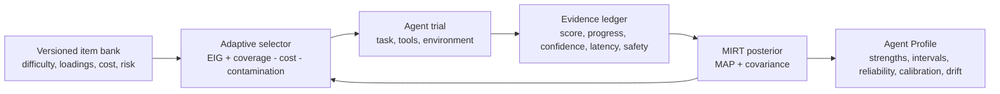

# Sprix SPECTRA

**Skill Profiling via Evidence-Calibrated Testing and Reliability Analysis**

[](https://github.com/wang2122/sprix-agent-spectra/actions/workflows/ci.yml)
[](https://www.python.org/)
[](LICENSE)
[](#research-status)

SPECTRA is an adaptive psychometric evaluation engine for autonomous AI agents. It estimates **what an agent is good at**, **how certain that estimate is**, and **whether the capability is reliable, calibrated, safe, and cost-efficient**. Instead of averaging a fixed benchmark, SPECTRA chooses the next trial by expected information gain and produces an evidence-backed multidimensional Agent Profile.

This repository is an open-source research output of **Sprix AI at 屿智同行**. The project is led by **Yichen Wang (CTO)** with **Yonghao Zhang (CEO, M.Eng. in Computer Science, Tsinghua University)** as a core contributor.

> Research status: the evaluator, simulator, tests, and benchmark harness are implemented. The bundled item bank is synthetic and intended for estimator validation. Real deployment claims require a separately calibrated, versioned task bank.

## Why SPECTRA

A single pass rate cannot tell a team whether an agent is a strong researcher but a weak operator, whether its apparent success is unstable, or whether it becomes unsafe under pressure. SPECTRA models eight separable dimensions by default:

`reasoning` · `planning` · `tool_use` · `coding` · `research` · `web_navigation` · `safety` · `recovery`

The ontology and bank are replaceable. Teams can define domain-specific dimensions such as customer support, quantitative finance, procurement, or software release engineering.

## Core contributions

- **Multidimensional capability inference** — fractional-response 2PL IRT with a Gaussian prior, MAP fitting, and Laplace posterior intervals.
- **Adaptive, cost-aware testing** — D-optimal expected information gain balanced against capability coverage, repeated-trial value, latency, monetary cost, and contamination risk.
- **Evidence beyond final accuracy** — partial progress, safety violations, confidence calibration, repeat consistency, efficiency, and temporal drift.
- **Conservative strengths** — strengths are ranked by posterior lower bounds, not point estimates; weak spots use upper bounds so sparse evidence is not overstated.
- **Auditability** — typed item/outcome schemas, deterministic experiments, machine-readable JSON, and human-readable profile reports.



## Quick start

```bash
python -m venv .venv
source .venv/bin/activate
pip install -e ".[dev]"
spectra-demo
```

Minimal API:

```python
from sprix_spectra import SpectraEvaluator, TrialOutcome

evaluator = SpectraEvaluator(dimensions, calibrated_item_bank)

while True:
    decision = evaluator.select_next()
    result = run_agent_on_item(decision.item_id)
    evaluator.add_outcome(TrialOutcome(
        item_id=decision.item_id,
        score=result.score,
        progress=result.progress,
        confidence=result.confidence,
        latency_ms=result.latency_ms,
        cost=result.cost,
        policy_violations=result.policy_violations,
    ))
    stop, reason = evaluator.stopping_status(max_trials=40, max_cost=50)
    if stop:
        break

profile = evaluator.profile("agent://production/researcher-v3")
```

See [`examples/quickstart.py`](examples/quickstart.py) for a runnable end-to-end example and [`ALGORITHM.md`](ALGORITHM.md) for the equations, assumptions, calibration protocol, and threats to validity.

## Profile semantics

| Output | Interpretation |
|---|---|
| Capability score | Logistic transform of the estimated latent trait; useful for profiles, not a universal percentage |
| 95% interval | Laplace posterior interval; wider means less evidence or weaker identifiability |
| Strengths | Dimensions with the strongest conservative lower bounds |
| Repeat consistency | Agreement on controlled repeat items |
| Calibration | Brier score, expected calibration error, and overconfidence when confidence is available |
| Safety | Violation rate on designated safety-critical trials |
| Drift | Standardized split-window shift; a monitoring signal, not a causal diagnosis |

## Reproducible synthetic benchmark

Run:

```bash
spectra-benchmark
pytest
```

The benchmark compares adaptive SPECTRA with random and round-robin selection across hidden synthetic agents. It reports latent RMSE, top-strength recovery, rank correlation, evaluation cost, and posterior interval width. The simulator includes nonlinear interactions, lapses, and observation noise that are absent from the fitted model.

We intentionally do **not** freeze a marketing table in this README: CI recomputes the deterministic experiment, and synthetic results must not be interpreted as real-world SOTA evidence.

## Research foundations

SPECTRA combines ideas from several research lines while adding a deployable Agent Profile and evidence ledger:

- **Interactive agent evaluation:** [AgentBench (ICLR 2024)](https://openreview.net/forum?id=zAdUB0aCTQ), [AgentBoard](https://openreview.net/forum?id=09Y7J22N9c), [GAIA (ICLR 2024)](https://openreview.net/forum?id=fibxvahvs3), and [WebArena (ICLR 2024)](https://openreview.net/forum?id=oKn9c6ytLx).
- **Reliability and tool-agent-user interaction:** [τ-bench (ICLR 2025)](https://openreview.net/forum?id=roNSXZpUDN) motivates repeated-trial reliability rather than one-shot pass rates.
- **Safety profiling:** [Agent-SafetyBench](https://arxiv.org/abs/2412.14470) demonstrates the need for agent-specific safety measurement.
- **Psychometric comparability:** [Comparing Test Sets with Item Response Theory (ACL 2021)](https://aclanthology.org/2021.acl-long.92/) motivates item-level difficulty/discrimination modeling.
- **Adaptive evaluation:** [ATLAS](https://arxiv.org/abs/2511.04689), [BanditCAT](https://proceedings.mlr.press/v264/sharpnack25a.html), and recent work on [cost-efficient general-ability estimation](https://arxiv.org/abs/2604.01418) motivate sequential value-of-information selection.
- **Agent-native evaluation infrastructure:** [AgentBeats](https://docs.agentbeats.org/) provides Green/Purple Agent evaluation roles over A2A; SPECTRA can serve as a profiling policy and evidence layer rather than redefining the protocol.

SPECTRA is an independent implementation. It does not claim reproduction or endorsement by the referenced authors.

## What SPECTRA is not

- It is not an A2A routing or scheduling protocol. The profile may inform a router, but evaluation and delegation are separate decisions.
- It is not a substitute for hidden, contamination-resistant tasks or human auditing.
- It does not infer a stable human-like personality from a few trajectories.
- It does not make a synthetic score comparable across organizations without shared calibration anchors.

## Roadmap

- [ ] Real reference-panel calibration pipeline and item-fit diagnostics
- [ ] AgentBeats Green Agent adapter and A2A evidence envelopes
- [ ] Hierarchical Bayesian model for agent families and tool stacks
- [ ] Differential item functioning and contamination canaries
- [ ] Online drift/change-point detector
- [ ] Signed JSON-LD Agent Profile for Sprix A2A routing

## Team and contribution

- **Yichen Wang** — project lead, evaluation algorithm and Sprix integration; CTO, 屿智同行
- **Yonghao Zhang** — product and systems direction; CEO, 屿智同行; M.Eng. in Computer Science, Tsinghua University

Contributions from researchers and engineers are welcome. Please read [`CONTRIBUTING.md`](CONTRIBUTING.md). GitHub commits, pull requests, reviews, and the repository Contributors graph remain the source of record for individual contributions.

## Citation

If this research prototype is useful, cite the software metadata in [`CITATION.cff`](CITATION.cff). Please do not describe the current alpha release as a peer-reviewed method.

## License

MIT © 2026 Sprix AI at 屿智同行 and contributors.
